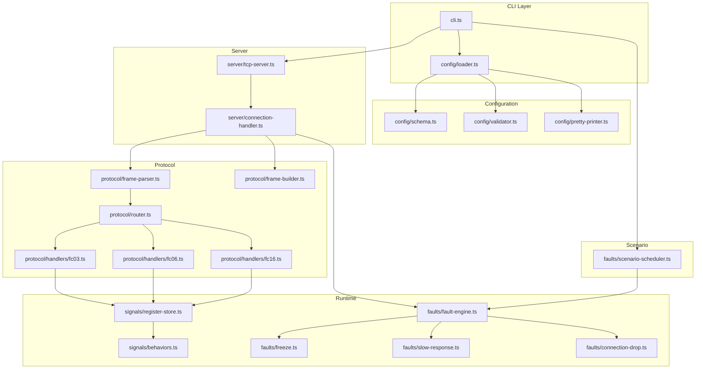
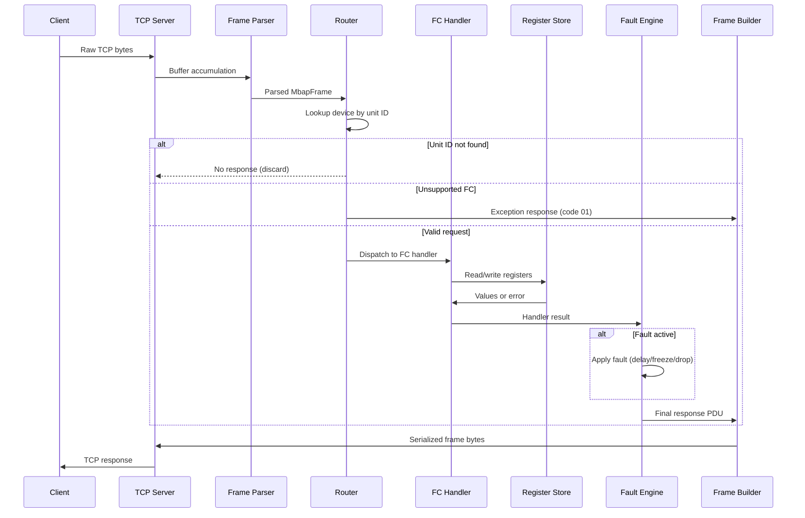

# Design Document: modbus-fault-sim

## Overview

modbus-fault-sim is a CLI tool that simulates Modbus TCP slave devices with programmable fault injection. It accepts a YAML configuration file describing virtual devices and a scenario timeline, starts a TCP server, and responds to Modbus TCP requests while injecting protocol-level faults (frozen registers, delayed responses, dropped connections, exception codes) at scheduled intervals.

The system is structured as a pipeline: incoming TCP bytes are parsed into Modbus frames, routed to the addressed device, processed by function-code handlers that read/write a register store, optionally disrupted by the fault injection layer, and serialized back to a response frame sent to the client.

### Key Design Decisions

1. **Single-process, event-loop architecture** — Node.js `net` module handles TCP concurrency via the event loop; no worker threads needed for the expected load.
2. **Immutable configuration after startup** — The YAML config is parsed and validated once; runtime state is mutable (register values, active faults) but the device topology is fixed.
3. **Fault layer sits between handler and response** — Faults intercept at the response stage, not the request stage, so request parsing remains fault-free and testable in isolation.
4. **Time abstraction** — All time-dependent code accepts an injectable clock function, enabling deterministic testing of behaviors and scenario timelines.

## Architecture



### Data Flow: Request Processing Pipeline



## Components and Interfaces

### src/protocol/frame-parser.ts

Accumulates TCP data into complete Modbus TCP frames using the MBAP length field. Handles stream fragmentation (partial frames) and frame coalescence (multiple frames in one TCP segment).

```typescript
interface MbapHeader {
  transactionId: number;   // uint16
  protocolId: number;      // uint16, must be 0x0000
  length: number;          // uint16, bytes after this field
  unitId: number;          // uint8
}

interface ModbusRequest {
  header: MbapHeader;
  functionCode: number;    // uint8
  data: Buffer;            // PDU payload after function code
}

/** Stateful parser that buffers incomplete frames. */
class FrameParser {
  /** Feed raw bytes; returns zero or more complete requests. */
  feed(data: Buffer): ModbusRequest[];
  /** Reset internal buffer (on connection close). */
  reset(): void;
}
```

**Validates:** Requirements 4.1–4.5, 5.2

### src/protocol/frame-builder.ts

Constructs valid Modbus TCP response frames with correct MBAP headers.

```typescript
interface FrameBuilderOptions {
  transactionId: number;
  unitId: number;
}

/** Build a response frame with correct MBAP header. */
function buildResponse(opts: FrameBuilderOptions, pdu: Buffer): Buffer;

/** Build an exception response frame (9 bytes total). */
function buildException(
  opts: FrameBuilderOptions,
  functionCode: number,
  exceptionCode: number
): Buffer;
```

**Validates:** Requirements 4.1–4.4, 5.1, 6.1

### src/protocol/router.ts

Routes parsed requests to the correct device and function code handler. Produces exception responses for unknown unit IDs and unsupported function codes.

```typescript
interface RouteResult {
  type: 'response' | 'exception' | 'discard' | 'close';
  pdu?: Buffer;
}

function route(
  request: ModbusRequest,
  devices: Map<number, Device>
): RouteResult;
```

**Routing rules:**
- Unit ID not in device map → `{ type: 'discard' }` (Req 1.3)
- Protocol ID ≠ 0x0000 → `{ type: 'discard' }` (Req 4.5)
- PDU length < 1 → `{ type: 'close' }` (Req 5.2)
- FC not in {0x03, 0x06, 0x10} → exception code 01 (Req 5.1)
- Otherwise → dispatch to handler

### src/protocol/handlers/fc03.ts

```typescript
function handleReadHoldingRegisters(
  request: ModbusRequest,
  store: RegisterStore
): RouteResult;
```

Validates quantity (1–125), address range, reads values from store. Returns PDU: `03 | byteCount | values...` or exception.

**Validates:** Requirements 1.1, 1.2, 6.2

### src/protocol/handlers/fc06.ts

```typescript
function handleWriteSingleRegister(
  request: ModbusRequest,
  store: RegisterStore
): RouteResult;
```

Validates target address exists and is not float32 type, writes value, echoes request PDU.

**Validates:** Requirements 2.1–2.3, 6.3

### src/protocol/handlers/fc16.ts

```typescript
function handleWriteMultipleRegisters(
  request: ModbusRequest,
  store: RegisterStore
): RouteResult;
```

Validates quantity (1–123), byte count consistency, address range, writes values.

**Validates:** Requirements 3.1–3.3, 6.2

### src/signals/register-store.ts

Manages the runtime state of all registers for a device. Supports typed reads (uint16, float32) and applies active behaviors to compute current values.

```typescript
interface RegisterDescriptor {
  name: string;
  address: number;           // Wire address (zero-based)
  type: 'uint16' | 'float32';
  initialValue: number;
  behavior?: BehaviorConfig;
}

class RegisterStore {
  constructor(registers: RegisterDescriptor[], clock: () => number);

  /** Read N consecutive registers starting at address. Returns uint16 values. */
  readRegisters(startAddress: number, quantity: number): number[] | ErrorCode;

  /** Write a single register (FC 06). */
  writeSingle(address: number, value: number): void | ErrorCode;

  /** Write multiple registers (FC 16). */
  writeMultiple(startAddress: number, values: number[]): void | ErrorCode;

  /** Check if an address exists in this store. */
  hasAddress(address: number): boolean;

  /** Freeze a register at its current value. */
  freeze(registerName: string): void;

  /** Unfreeze a register. */
  unfreeze(registerName: string): void;
}
```

**Validates:** Requirements 1.1, 2.1–2.2, 3.1, 10.1–10.4, 13.1–13.4

### src/signals/behaviors.ts

Value generators that produce time-varying register values.

```typescript
interface BehaviorConfig {
  type: 'sine' | 'ramp' | 'constant';
  params: SineParams | RampParams | ConstantParams;
}

interface SineParams {
  min: number;
  max: number;
  periodMs: number;
}

interface RampParams {
  start: number;
  end: number;
  durationMs: number;
}

interface ConstantParams {
  value: number;
}

/** Compute the current value for a behavior given elapsed time in ms. */
function computeBehaviorValue(config: BehaviorConfig, elapsedMs: number): number;

/** Sine: midpoint + amplitude * sin(2π * elapsed / period) */
function computeSine(params: SineParams, elapsedMs: number): number;

/** Ramp: start + (end - start) * min(elapsed / duration, 1), truncated toward zero */
function computeRamp(params: RampParams, elapsedMs: number): number;
```

**Validates:** Requirements 11.1–11.4, 12.1–12.3

### src/faults/fault-engine.ts

Central fault registry that tracks active faults per device/register and applies them to handler results.

```typescript
type FaultType = 'freeze_register' | 'slow_response' | 'connection_drop';

interface ActiveFault {
  type: FaultType;
  target: string;          // device unit ID or register name
  activatedAt: number;     // timestamp ms
  duration?: number;       // ms, undefined = indefinite
  params: Record<string, unknown>;
}

class FaultEngine {
  /** Activate a fault. */
  activate(fault: ActiveFault): void;

  /** Deactivate expired faults based on current time. */
  tick(nowMs: number): void;

  /** Apply faults to a pending response. Returns modified result or action. */
  applyFaults(
    deviceUnitId: number,
    result: RouteResult,
    send: (buf: Buffer) => void,
    close: () => void
  ): Promise<void>;

  /** Check if a register is frozen. */
  isFrozen(deviceUnitId: number, registerName: string): boolean;
}
```

**Validates:** Requirements 13.1–13.4, 14.1–14.4, 15.1–15.2

### src/faults/scenario-scheduler.ts

Reads the scenario timeline from configuration and schedules fault activations using `setTimeout`.

```typescript
interface ScenarioEntry {
  offsetMs: number;
  faultType: FaultType;
  target: string;
  params: Record<string, unknown>;
  duration?: number;
}

class ScenarioScheduler {
  constructor(
    entries: ScenarioEntry[],
    faultEngine: FaultEngine,
    clock: () => number,
    log: (msg: string) => void
  );

  /** Start scheduling. Called when server begins listening. */
  start(): void;

  /** Cancel all pending timers (for graceful shutdown). */
  stop(): void;
}
```

**Validates:** Requirements 16.1–16.4

### src/config/schema.ts

TypeScript interfaces defining the expected shape of the YAML configuration.

```typescript
interface ConfigFile {
  listen: ListenConfig;
  devices: DeviceConfig[];
  scenario: ScenarioEntryConfig[];
}

interface ListenConfig {
  host: string;
  port: number;
}

interface DeviceConfig {
  name: string;
  unitId: number;
  addressBase?: 'documentation' | 'zero';
  registers: RegisterConfig[];
}

interface RegisterConfig {
  name: string;
  address: number;
  type: 'uint16' | 'float32';
  initialValue: number;
  behavior?: BehaviorConfigYaml;
}

interface BehaviorConfigYaml {
  type: 'sine' | 'ramp' | 'constant';
  min?: number;
  max?: number;
  periodMs?: number;
  start?: number;
  end?: number;
  durationMs?: number;
  value?: number;
}

interface ScenarioEntryConfig {
  offsetMs: number;
  fault: FaultType;
  target: string;
  delayMs?: number;
  durationMs?: number;
}
```

### src/config/validator.ts

Validates a parsed YAML object against the schema and business rules.

```typescript
interface ValidationError {
  path: string;          // dot-notation path to invalid field
  message: string;       // human-readable reason
}

function validateConfig(raw: unknown): ConfigFile | ValidationError[];
```

**Validation rules include:**
- Required field presence (listen, devices, scenario)
- Type checking for all fields
- `addressBase: 'documentation'` requires all addresses ≥ 40001 (Req 8.3)
- Overlap detection across all registers in a device (Req 9.1–9.3)
- Float32 registers claim two addresses (Req 9.3)
- Scenario entries reference valid fault types and existing targets (Req 16.4)

**Validates:** Requirements 7.1–7.3, 8.1–8.3, 9.1–9.3, 16.4

### src/config/loader.ts

Orchestrates YAML parsing, validation, and conversion to runtime structures.

```typescript
function loadConfig(filePath: string): ConfigFile | ValidationError[];
```

### src/config/pretty-printer.ts

Serializes a validated `ConfigFile` back to YAML text.

```typescript
function prettyPrint(config: ConfigFile): string;
```

**Validates:** Requirements 7.4–7.5

### src/server/tcp-server.ts

Wraps Node.js `net.Server` to manage the TCP listener lifecycle.

```typescript
interface TcpServerOptions {
  host: string;
  port: number;
  onConnection: (socket: net.Socket) => void;
}

class TcpServer {
  constructor(options: TcpServerOptions);
  start(): Promise<void>;
  stop(): Promise<void>;
  closeAllConnections(): void;
}
```

**Validates:** Requirements 15.1–15.2, 17.1, 17.5

### src/server/connection-handler.ts

Manages a single TCP connection: feeds data to FrameParser, routes frames, applies faults, sends responses.

```typescript
function handleConnection(
  socket: net.Socket,
  devices: Map<number, Device>,
  faultEngine: FaultEngine
): void;
```

### src/cli.ts

Entrypoint. Parses arguments, loads config, starts server, begins scenario.

```typescript
async function main(args: string[]): Promise<void>;
```

**Validates:** Requirements 17.1–17.6

## Data Models

### Register Storage Model

Each device maintains a flat array of uint16 slots indexed by wire address. Float32 registers occupy two consecutive slots.

```typescript
interface RegisterSlot {
  name: string;
  type: 'uint16' | 'float32';
  baseAddress: number;       // wire address of first word
  wordCount: number;         // 1 for uint16, 2 for float32
  currentValue: number;      // raw numeric value
  behavior: BehaviorConfig | null;
  frozen: boolean;
  frozenValue: number | null;
}
```

**Address resolution:**
- For `addressBase: 'documentation'`: `wireAddress = declaredAddress - 40001`
- For `addressBase: 'zero'` (default): `wireAddress = declaredAddress`

### Float32 Encoding

IEEE 754 single-precision, big-endian word order:
- Address N: high 16 bits (bits 31–16)
- Address N+1: low 16 bits (bits 15–0)

```typescript
function float32ToWords(value: number): [highWord: number, lowWord: number] {
  const buf = Buffer.alloc(4);
  buf.writeFloatBE(value, 0);
  return [buf.readUInt16BE(0), buf.readUInt16BE(2)];
}

function wordsToFloat32(high: number, low: number): number {
  const buf = Buffer.alloc(4);
  buf.writeUInt16BE(high, 0);
  buf.writeUInt16BE(low, 2);
  return buf.readFloatBE(0);
}
```

### Behavior Value Computation

**Sine** (Req 11.1–11.4):
```
midpoint = (min + max) / 2
amplitude = (max - min) / 2
value = midpoint + amplitude * sin(2π * elapsedMs / periodMs)
```
For uint16 registers: `Math.round(value)` (half-up rounding).

**Ramp** (Req 12.1–12.3):
```
progress = min(elapsedMs / durationMs, 1.0)
value = start + (end - start) * progress
```
Truncated toward zero: `Math.trunc(value)`.

### Overlap Detection Algorithm

For each device, build a set of claimed addresses:
1. For each register, compute `range = [baseAddress, baseAddress + wordCount - 1]`
2. For each pair of registers, check if ranges intersect
3. Collect all conflicts (don't stop at first)

```typescript
function detectOverlaps(registers: RegisterDescriptor[]): OverlapError[] {
  const errors: OverlapError[] = [];
  for (let i = 0; i < registers.length; i++) {
    for (let j = i + 1; j < registers.length; j++) {
      if (rangesOverlap(registers[i], registers[j])) {
        errors.push({ register1: registers[i].name, register2: registers[j].name, ... });
      }
    }
  }
  return errors;
}
```

### Scenario Timeline Execution

The scenario scheduler sorts entries by offset (stable sort preserving declaration order for ties), then schedules each as a `setTimeout(offsetMs - elapsed)` relative to server start time. On fire:
1. Log to stdout: `[{elapsedMs}ms] {faultType} activated on {target}`
2. Call `faultEngine.activate(...)` with the fault parameters
3. If a duration is specified, schedule deactivation at `offsetMs + durationMs`

## Correctness Properties

*A property is a characteristic or behavior that should hold true across all valid executions of a system — essentially, a formal statement about what the system should do. Properties serve as the bridge between human-readable specifications and machine-verifiable correctness guarantees.*

### Property 1: MBAP Header Invariants

*For any* valid Modbus request that produces a response, the response frame SHALL have: bytes[0..1] equal to the request's transaction ID, bytes[2..3] equal to 0x0000, bytes[4..5] equal to the number of bytes following (unit ID + PDU length), and byte[6] equal to the request's unit ID.

**Validates: Requirements 4.1, 4.2, 4.3, 4.4**

### Property 2: Non-Zero Protocol ID Discards

*For any* incoming frame with a protocol ID other than 0x0000, the router SHALL return a discard result and produce no response bytes.

**Validates: Requirements 4.5**

### Property 3: Unknown Unit ID Discards

*For any* incoming frame whose unit ID does not appear in the device map, the router SHALL return a discard result and produce no response bytes.

**Validates: Requirements 1.3**

### Property 4: FC 03 Response Structure

*For any* valid FC 03 request with quantity in [1, 125] and all addresses in the register map, the response PDU SHALL contain function code 0x03, a byte count equal to 2 × quantity, followed by exactly that many bytes of register data in big-endian order matching the current register values.

**Validates: Requirements 1.1**

### Property 5: FC 03 Quantity Validation

*For any* FC 03 request with a quantity outside [1, 125], the system SHALL respond with an exception frame containing function code 0x83 and exception code 0x03.

**Validates: Requirements 1.2**

### Property 6: FC 06 Echo Response

*For any* valid FC 06 request targeting a uint16 register that exists in the register map, the response PDU SHALL be an exact byte-for-byte echo of the request PDU (function code 0x06, address, value).

**Validates: Requirements 2.1**

### Property 7: FC 06 Write-Then-Read Round Trip

*For any* uint16 register and any uint16 value, writing via FC 06 and then reading via FC 03 SHALL return the written value.

**Validates: Requirements 2.2**

### Property 8: FC 06 Float32 Rejection

*For any* FC 06 request targeting any address occupied by a float32 register (base address or base address + 1), the system SHALL respond with an exception frame containing exception code 0x02.

**Validates: Requirements 2.3, 10.4**

### Property 9: FC 16 Response Structure

*For any* valid FC 16 request with quantity in [1, 123], consistent byte count, and all target addresses in the register map, the response PDU SHALL contain function code 0x10 followed by the echoed start address (2 bytes) and echoed quantity (2 bytes).

**Validates: Requirements 3.1**

### Property 10: FC 16 Quantity Validation

*For any* FC 16 request with a quantity outside [1, 123], the system SHALL respond with an exception frame containing exception code 0x03.

**Validates: Requirements 3.2**

### Property 11: FC 16 Byte Count Consistency

*For any* FC 16 request where the byte count field does not equal 2 × quantity, the system SHALL respond with an exception frame containing exception code 0x03.

**Validates: Requirements 3.3**

### Property 12: Unsupported Function Code Exception

*For any* request with a function code not in {0x03, 0x06, 0x10}, the system SHALL respond with a 9-byte exception frame containing the received function code OR'd with 0x80 and exception code 0x01.

**Validates: Requirements 5.1**

### Property 13: Invalid Address Exception

*For any* request (FC 03, 06, or 16) that references a wire address not present in the target device's register map, the system SHALL respond with an exception frame containing the request's function code OR'd with 0x80 and exception code 0x02.

**Validates: Requirements 6.1, 6.3**

### Property 14: Multi-Register Range Validation

*For any* FC 03 or FC 16 request where any address in the range [startAddress, startAddress + quantity - 1] falls outside the device's register map, the system SHALL respond with an exception frame containing exception code 0x02.

**Validates: Requirements 6.2**

### Property 15: Configuration Round Trip

*For any* valid configuration structure, serializing it with the Pretty_Printer and then parsing the output with the Parser SHALL produce a structure that is deeply equal to the original (all field names, values, and collection orderings preserved).

**Validates: Requirements 7.4, 7.5**

### Property 16: Address Base Conversion

*For any* register address A where A ≥ 40001, when `addressBase` is "documentation", the computed wire address SHALL equal A - 40001. *For any* register address A when `addressBase` is absent or "zero", the wire address SHALL equal A unchanged.

**Validates: Requirements 8.1, 8.2**

### Property 17: Documentation Address Rejection

*For any* register address A < 40001 when `addressBase` is "documentation", the validator SHALL reject the configuration with an error message identifying the invalid address.

**Validates: Requirements 8.3**

### Property 18: Overlap Detection Completeness

*For any* set of registers on a device where N pairs have overlapping wire address ranges (considering float32 registers as claiming 2 addresses), the validator SHALL report exactly those N overlaps, naming both registers and their conflicting addresses in each error.

**Validates: Requirements 9.1, 9.2, 9.3**

### Property 19: Float32 Encoding Round Trip

*For any* IEEE 754 representable float32 value, encoding it to two uint16 words (high word, low word) and decoding back SHALL produce a value that is bitwise identical to the original.

**Validates: Requirements 10.1, 10.3**

### Property 20: Float32 Read Consistency

*For any* float32 register holding value V, reading the two consecutive addresses via FC 03 SHALL return word values that, when decoded as IEEE 754 big-endian, equal V.

**Validates: Requirements 10.1, 10.2**

### Property 21: Sine Behavior Formula

*For any* sine behavior configuration (min, max, periodMs) and any elapsed time T ≥ 0, the computed value SHALL equal midpoint + amplitude × sin(2π × T / periodMs), where midpoint = (min + max) / 2 and amplitude = (max - min) / 2.

**Validates: Requirements 11.1**

### Property 22: Sine Behavior Periodicity

*For any* sine behavior configuration and any elapsed time T, the value at time T SHALL equal the value at time T + periodMs (the function is periodic with the configured period).

**Validates: Requirements 11.3**

### Property 23: Sine Behavior Initial Conditions

*For any* sine behavior configuration, the value at T = 0 SHALL equal the midpoint, and the value at T = periodMs / 4 SHALL equal the maximum.

**Validates: Requirements 11.2**

### Property 24: Sine Integer Rounding

*For any* sine behavior on a uint16 register, the returned value SHALL equal Math.round of the continuous formula output (half-up rounding).

**Validates: Requirements 11.4**

### Property 25: Ramp Behavior Formula

*For any* ramp behavior configuration (start, end, durationMs) and any elapsed time T where 0 ≤ T ≤ durationMs, the computed value SHALL equal Math.trunc(start + (end - start) × (T / durationMs)).

**Validates: Requirements 12.1, 12.3**

### Property 26: Ramp Behavior Clamping

*For any* ramp behavior configuration and any elapsed time T > durationMs, the computed value SHALL equal the configured end value.

**Validates: Requirements 12.2**

### Property 27: Freeze Captures and Holds Value

*For any* register with a behavior, when a freeze_register fault is activated at time T₁, all subsequent reads at any time T₂ > T₁ SHALL return the value that the register held at T₁, regardless of behavior progression.

**Validates: Requirements 13.1**

### Property 28: Freeze Ignores Writes

*For any* frozen register, a write request SHALL produce a success response (echo) but a subsequent read SHALL still return the frozen value, not the written value.

**Validates: Requirements 13.2**

### Property 29: Freeze-Unfreeze Round Trip

*For any* register with a behavior, freezing and then unfreezing SHALL restore live behavior values — the read value after unfreeze at time T SHALL equal the behavior's computed value at T.

**Validates: Requirements 13.3**

### Property 30: Partial Freeze in Multi-Register Read

*For any* multi-register read spanning both frozen and unfrozen registers, the response SHALL contain the frozen value for each frozen register and the live computed value for each unfrozen register.

**Validates: Requirements 13.4**

### Property 31: Slow Response Delay Application

*For any* request to a device with an active slow_response fault configured with delay D, the response SHALL be delayed by exactly D milliseconds (verified via injectable clock).

**Validates: Requirements 14.1**

### Property 32: Slow Response Duration Expiry

*For any* slow_response fault with a configured duration, after the duration elapses from activation time, the fault SHALL no longer apply to subsequent requests.

**Validates: Requirements 14.2**

### Property 33: Scenario Activation Order

*For any* set of scenario entries, faults SHALL be activated in ascending order of their offset values; entries with equal offsets SHALL be activated in their declaration order from the configuration file.

**Validates: Requirements 16.2**

### Property 34: Scenario Entry Validation

*For any* scenario entry that references a fault type not in {freeze_register, slow_response, connection_drop} or a target that does not match any configured device or register, the validator SHALL reject the configuration with an error identifying the invalid entry.

**Validates: Requirements 16.4**

## Error Handling

### Configuration Errors (Fail-Fast at Startup)

| Error Condition | Behavior | Exit Code |
|----------------|----------|-----------|
| File not found | Print path to stderr | 1 |
| Invalid YAML syntax | Print parse error with line/col to stderr | 1 |
| Missing required field | Print field path + "required" to stderr | 1 |
| Wrong type | Print field path + expected vs actual type | 1 |
| Address < 40001 with documentation base | Print address + constraint message | 1 |
| Overlapping registers | Print both register names + conflicting addresses | 1 |
| Invalid scenario reference | Print entry index + invalid target/type | 1 |
| No arguments provided | Print usage message to stderr | 1 |

All validation errors are collected and reported together (not fail-on-first). The validator returns an array of `ValidationError` objects.

### Protocol Errors (Runtime, Per-Request)

| Error Condition | Response |
|----------------|----------|
| Protocol ID ≠ 0x0000 | Silent discard (no response) |
| Unit ID not in device map | Silent discard (no response) |
| PDU < 1 byte | Close connection |
| Unsupported function code | Exception frame: FC+0x80, code 01 |
| Address out of range | Exception frame: FC+0x80, code 02 |
| Quantity out of range | Exception frame: FC+0x80, code 03 |
| Byte count mismatch (FC 16) | Exception frame: FC+0x80, code 03 |
| FC 06 on float32 register | Exception frame: FC+0x80, code 02 |

### Connection Errors

- TCP socket errors (ECONNRESET, etc.): Log warning, clean up connection state, continue accepting new connections.
- Frame parser encounters incomplete data: Buffer until complete frame arrives; connection timeout handled by client.

### Shutdown

- SIGINT/SIGTERM: Cancel all scenario timers, close TCP server (stop accepting), destroy all sockets with 5s grace period, exit 0.
- If connections don't close within 5s: Force-destroy remaining sockets, exit 0.

## Testing Strategy

### Property-Based Testing Library

**Library:** [fast-check](https://fast-check.dev/) — the standard property-based testing framework for TypeScript, integrates directly with Vitest.

**Configuration:**
- Minimum 100 iterations per property test (`numRuns: 100`)
- Each test tagged with: `// Feature: modbus-fault-sim, Property N: <title>`
- Shrinking enabled for minimal counterexamples

### Test Organization

```
tests/
├── protocol/
│   ├── frame-parser.test.ts       # Properties 1-3: MBAP parsing, discards
│   ├── frame-builder.test.ts      # Property 1: MBAP header invariants
│   ├── fc03.test.ts               # Properties 4-5: FC 03 response/validation
│   ├── fc06.test.ts               # Properties 6-8: FC 06 echo/round-trip/float32
│   ├── fc16.test.ts               # Properties 9-11: FC 16 response/validation
│   ├── router.test.ts             # Properties 2-3, 12-14: routing/exceptions
│   └── float32.test.ts            # Properties 19-20: encoding round trip
├── config/
│   ├── validator.test.ts          # Properties 16-18, 34: address/overlap/scenario validation
│   ├── pretty-printer.test.ts     # Property 15: config round trip
│   └── loader.test.ts             # Integration: full load pipeline
├── signals/
│   ├── sine.test.ts               # Properties 21-24: sine formula/periodicity/rounding
│   ├── ramp.test.ts               # Properties 25-26: ramp formula/clamping
│   └── register-store.test.ts     # Properties 7, 27-30: write round-trip, freeze/unfreeze
├── faults/
│   ├── fault-engine.test.ts       # Properties 31-32: slow response delay/expiry
│   └── scenario-scheduler.test.ts # Property 33: activation order
└── integration/
    ├── cli.test.ts                # Examples: 17.2-17.4 error cases
    ├── connection-drop.test.ts    # Integration: 15.1-15.2 TCP behavior
    └── end-to-end.test.ts         # Smoke: full startup and request/response
```

### Property-Based Tests (via fast-check)

Each correctness property from the design maps to a single property-based test. Key generators:

| Generator | Produces |
|-----------|----------|
| `arbTransactionId()` | uint16 random transaction ID |
| `arbUnitId(validIds)` | uint8, optionally constrained to valid/invalid |
| `arbFunctionCode(exclude)` | uint8 function code not in exclude set |
| `arbQuantity(min, max)` | uint16 within bounds |
| `arbRegisterMap(n)` | Array of n non-overlapping RegisterDescriptors |
| `arbWireAddress(map)` | Address guaranteed to be in/out of map |
| `arbSineParams()` | Valid SineParams (min < max, periodMs > 0) |
| `arbRampParams()` | Valid RampParams (durationMs > 0) |
| `arbConfigFile()` | Complete valid ConfigFile structure |
| `arbFloat32()` | IEEE 754 representable float (no NaN/Infinity) |
| `arbElapsedMs(max)` | Non-negative integer up to max |

### Unit Tests (via Vitest)

Unit tests cover specific examples, edge cases, and integration points:

- **Frame parser edge cases:** Partial frames, coalesced frames, zero-length PDU
- **CLI error cases:** Missing file, invalid config, no arguments (Requirements 17.2–17.4)
- **Connection drop:** TCP socket closure behavior (Requirements 15.1–15.2)
- **Scenario timing:** Within-50ms activation tolerance (Requirement 16.1)
- **Graceful shutdown:** SIGINT/SIGTERM handling (Requirement 17.5)
- **Slow response independence:** Multiple concurrent delays (Requirement 14.4)

### Integration Tests

- Full end-to-end: Start server with example config, send real Modbus TCP frames via `net.Socket`, verify responses.
- Scenario execution: Run a multi-fault scenario and verify correct activation sequence and log output.
- Connection drop and reconnect: Verify TCP reconnection within 100ms after drop fault.

### Injectable Time

All time-dependent modules accept a `clock: () => number` parameter. Tests inject a deterministic clock to:
- Verify exact behavior values at specific times
- Test scenario scheduling without real delays
- Validate fault duration expiry precisely
